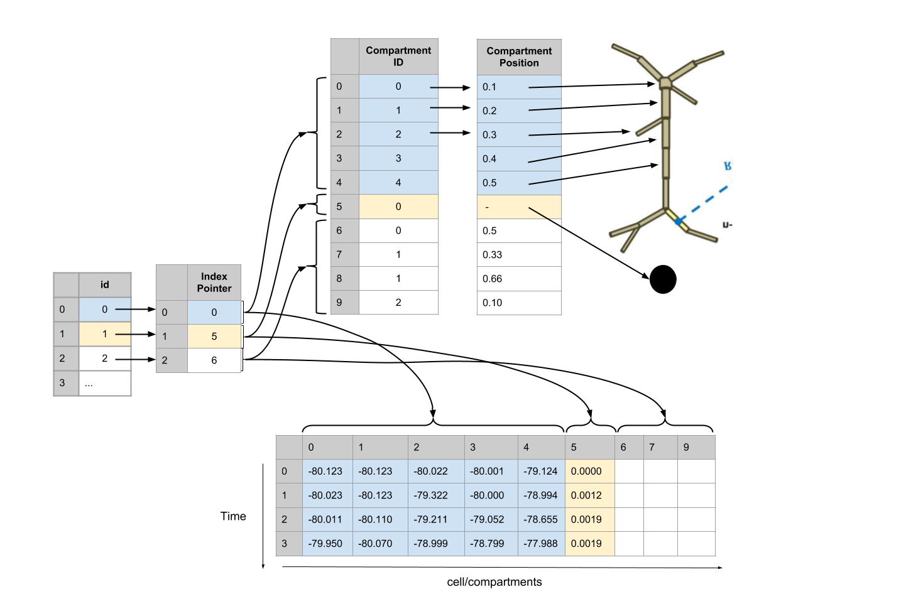

# ndx-simulation-output Extension for NWB:N

## An extension for output data of large-scale simulations
 Developed in collaboration between the Soltesz lab and the Allen Institute during [NWB Hackathon #4](https://github.com/NeurodataWithoutBorders/nwb_hackathons/tree/master/HCK04_2018_Seattle/Projects/NetworkOutput) by Ben Dichter*, Kael Dai*, Aaron Milstein, Yazan Billeh, Andrew Tritt, Jean-Christophe Fillion-Robin, Anton Akhipov, Oliver Ruebel, Nicholas Cain, Kristofer Bouchard, and Ivan Soltesz

This extension defines a single NWB data type, `CompartmentSeries`, that allows you to store continuous data (e.g. membrane potential) from many compartments of many cells in a scalable way. 



This structure stores an arbitrarily large number of cells and cellular compartments with 5 datasets. It can scale to a million or more neurons, and enables efficient parallel read and write. It is designed to handle NEURON output data and to easily interface with the SONATA format.

## Guide
### python
#### installation
```
pip install git+https://github.com/bendichter/ndx-simulation-output.git
```

#### usage
```python
from pynwb import NWBHDF5IO, NWBFile
from datetime import datetime
from ndx_simulation_output import CompartmentSeries, Compartments, SimulationMetaData
import numpy as np


compartments = Compartments()
compartments.add_row(number=[0, 1, 2, 3, 4], position=[0.1, 0.2, 0.3, 0.4, 0.5])
compartments.add_row(number=[0], position=[np.nan])

nwbfile = NWBFile('description', 'id', datetime.now().astimezone())

nwbfile.add_lab_meta_data(SimulationMetaData(name='simulation', compartments=compartments))
cs = CompartmentSeries('membrane_potential', np.random.randn(10, 6),
                       compartments=compartments,
                       unit='V', rate=100.)
nwbfile.add_acquisition(cs)

with NWBHDF5IO('test_compartment_series.nwb', 'w') as io:
    io.write(nwbfile)

with NWBHDF5IO('test_compartment_series.nwb', 'w') as io:
    io.write(nwbfile)
```

conversion from SONTATA:
```python
from ndx_simulation_output.io import sonata2nwb

sonata2nwb('sonata_fpath', 'save_path')
```

### MATLAB
#### installation

command line:
```
git clone https://github.com/bendichter/ndx-simulation-output.git
```

in matlab:
```matlab
generateExtension('/path/to/ndx-simulation-output/spec/ndx-simulation-output.namespace.yaml');
```

#### usage
```matlab
(TODO: move Compartments to SimulationMetaData)
[number, number_index] = util.create_indexed_column( ...
    {[0, 1, 2, 3, 4], 0}, '/acquisition/compartments/number');

[position, position_index] = util.create_indexed_column( ...
    {[0.1, 0.2, 0.3, 0.4, 0.5], 0}, '/acquisition/compartments/position');

compartments = types.simulation_output.Compartments( ...
    'colnames', {'number', 'position'}, ...
    'description', 'membrane potential from various compartments', ...
    'id', types.core.ElementIdentifiers('data', int64(0:5)));

compartments.position = position;
compartments.position_index = position_index;
compartments.number = number;
compartments.number_index = number_index;

membrane_potential = types.simulation_output.CompartmentSeries( ...
    'data', randn(10,6), ...
    'compartments', types.untyped.SoftLink('/acquisition/compartments'), ...
    'data_unit', 'V', ...
    'starting_time_rate', 100., ...
    'starting_time', 0.0);

nwb.acquisition.set('compartments', compartments);
nwb.acquisition.set('membrane_potential', membrane_potential);
```

## Talks
Ben Dichter*, Kael Dai*, Aaron Milstein, Yazan Billeh, Andrew Tritt, Jean-Christophe Fillion-Robin, Anton Akhipov, Oliver Ruebel, Nicholas Cain, Kristofer Bouchard, Ivan Soltesz. NWB extension for storing results of large-scale neural network simulations. NeuroInformatics. Montreal, Canada (2018). [video](https://www.youtube.com/watch?v=uuYQW0EE2GY).
